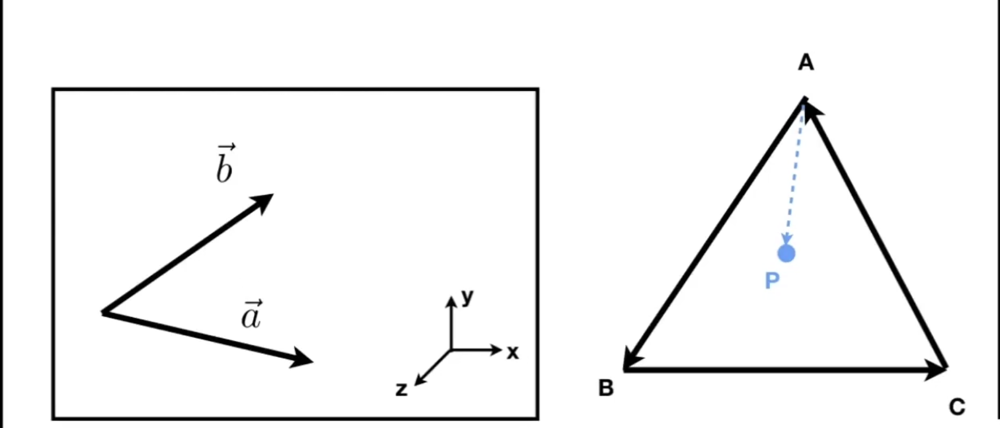

# 向量与线性代数

## 矩阵

## 向量

- 方向 + 长度

- 单位向量，表示长度为1的向量；向量 / 向量长度 

- 向量求和
  
  - 三角形法则：相加的向量首位相连，起点和终点相连，就是向量的和
  
  - 平行四边形法则：平移向量，使得向量围城一个平行四边形，对角线就是向量的和

- 向量的乘法
  
  - 点乘
    
    - 点乘的结果是一个数
    
    - 点乘满足交换律，结合律和分配律
    
    - 点乘就是b在a上的投影 (projection of b向量 onto a向量)
      
      

    - 在坐标系下向量的点乘 
      
      

    - 点乘的作用
      - measure how close two direction are
      - decompose a vector
      - determine  forward / backward

    因为cos在第一和第四象限是正的；两个向量越接近，点乘的结果越接近1，越远越接近-1。

  
  - 差乘

    

    - 结果是垂直于两个初始向量的<b>向量</b>

    - 满足右手定则(opengl 是右手系，directX, unreal, unity 都是左手系)

    - Vector a X Vector b  a 旋转到 b 方向,大拇指对应的方向就是，就是结果向量的方向 

    - 不满足交换律 (a X b = - b X a)， 满足结合律和分配率

    

    - 叉乘的作用

      - determine left / right
      - determine inside / outside 

      - a X b 是正的，说明 a 在 b的右侧（右手定则）

      - ab X ap, bc X bp, ca X cp 三个结果方向相同，则说明 P 在 三角形内(和三角形给定三个点的顺序无关，无论是顺时针还是逆时针都可以)

    

