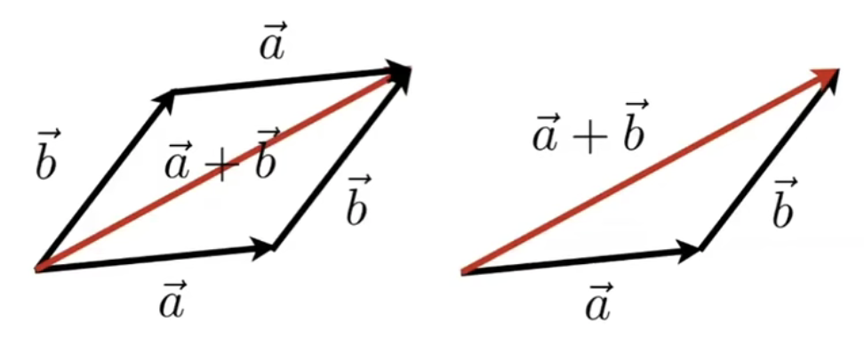

# 线性代数

## 向量

- 方向 + 长度

- 单位向量，表示长度为1的向量；向量 / 向量长度 

- 向量求和(add)
  
  - 三角形法则：相加的向量首位相连，起点和终点相连，就是向量的和
  
  - 平行四边形法则：平移向量，使得向量围城一个平行四边形，对角线就是向量的和

    

- 向量的乘法
  
  - 点乘(dot)
    
    - 点乘的结果是一个数
    
    - 点乘满足交换律，结合律和分配律
    
    - 点乘就是b在a上的投影 (projection of b向量 onto a向量)
      
      

    > $\vec{a}\cdot\vec{b} = ||\vec{a}||*||\vec{b}||*cos()$
    > $cos()v1 = \frac{\vec{a}\cdot\vec{b}}{||\vec{a}||*||\vec{b}||} =\widehat{a} \cdot \widehat{b}$

    - 在坐标系下向量的点乘 
      
      

    我们做一个反余弦则可以得到两个向量之间的弧度，在根据弧度转换为角度
    >$cos(rad) = \vec{a}\cdot\vec{b} = \begin{pmatrix} ax\\ ay\\ az \end{pmatrix} \cdot \begin{pmatrix} bx\\ by\\ bz \end{pmatrix} = ax*bx+ay*by+az*bz$
    > $rad = Math.acos(cos(rad))$
    > $deg = 180/Math.PI * rad$

    - 点乘的作用
      - 两个向量的接近程度 measure how close two direction are
      - 分解向量 decompose a vector
      - 向量的前后 determine  forward / backward

      

    > 向量$\vec{b}$在虚线的上方，那么两个向量点乘的结果是正数。
    > 向量$\vec{c}$在虚线的下方，那么两个向量点乘的结果是负数。
    > 如果向量在虚线上，那么两个向量点乘的结果是0。
      <!-- 因为cos在第一和第四象限是正的； -->
    > 两个向量越接近，点乘的结果越接近1，越远越接近-1。垂直是0。
  
  - 差乘(cross)

    

    - 结果是垂直于两个初始向量的<b>向量</b>

    - 满足右手定则(opengl 是右手系，directX, unreal, unity 都是左手系)

    - $\vec{a}\times\vec{b}$  $\vec{a}$ 旋转到 $\vec{b}$ 方向,大拇指对应的方向就是结果向量的方向 

    - 不满足交换律 ($\vec{a}\times\vec{b}$ = $-\vec{b}\times\vec{a}$)， 满足结合律和分配率

    

      >$\vec{a}\times\vec{b} = \begin{pmatrix} ay*bz - by*az\\ az*bx - ax*bz\\ ax*by - by*ax \end{pmatrix}$

    - 叉乘的作用

      - determine left / right
      - determine inside / outside 

      -  $\vec{a}\times\vec{b}$ 是正的，说明 $\vec{a}$ 在 $\vec{b}$ 的右侧（右手定则）

      - $\vec{ab}\times\vec{ap}$, $\vec{bc}\times\vec{bp}$, $\vec{ca}\times\vec{cp}$ 三个结果向量的方向相同，则说明 P 在 三角形内(和三角形给定三个点的顺序无关，无论是顺时针还是逆时针都可以)

    

## 矩阵

  - 两个矩阵相乘得到的还是一个矩阵。
  - 矩阵最重要的一点就是 第一个矩阵的 列 = 第二个矩阵的行

    >$\begin{pmatrix} M*N \end{pmatrix} \begin{pmatrix} N*P \end{pmatrix} = \begin{pmatrix} M*P \end{pmatrix}$

    > 第一个矩阵的列数一定要是第二个矩阵的行数
    三行两列的矩阵乘以两行四列的的矩阵，得到的是一个三行四列的矩阵

      

    - 不存在<b>交换律</b>(只有特殊情况才有，比如0向量)，有结合律和分配率

  - 矩阵和向量相乘
    -  向量必须是一个列向量(m x 1)
    -  key for transforming points
    -  2D reflection about y-axis(按y轴进行操作: x 变成负的， y轴不变)

  

  - 矩阵的转置
    

    > $\begin{pmatrix} 1&2 \\ 3&4 \\ 5&6 \end{pmatrix}^T = \begin{pmatrix} 1&3&5 \\ 2&4&6 \end{pmatrix}$

    > $\begin{pmatrix}A*B\end{pmatrix}^T = \begin{pmatrix} B \end{pmatrix}^T * \begin{pmatrix} A \end{pmatrix}^T$

  - 矩阵的逆
    

    如果有一个矩阵B，他和你当前的矩阵A相乘得到的结果为单位矩阵，那么这两个矩阵可以称之为互逆的矩阵。
    我们把矩阵B称为矩阵A的逆矩阵。

    > $\begin{pmatrix} 1&2&1 \\ 2&1&4 \\ 1&2&2 \end{pmatrix} * \begin{pmatrix} 2&0.66&-2.33\\ 0&-0.33&0.66\\ -1&0&1 \\ \end{pmatrix}= \begin{pmatrix} 1&0&0 \\ 0&1&0 \\ 0&0&1 \end{pmatrix}$

    两个矩阵相乘在逆转 = 后一个矩阵的逆乘以前一个矩阵的逆
    > $\begin{pmatrix} A*B \end{pmatrix}^-1 = \begin{pmatrix} B \end{pmatrix}^-1 * \begin{pmatrix} A \end{pmatrix}^-1$

  - 点乘叉乘的矩阵形式

    

    > $\vec{a}\cdot\vec{b} = \vec{a}^T*\vec{b} = \begin{pmatrix} ax \\ ay \\ az \end{pmatrix}*\begin{pmatrix} bx&by&bz \end{pmatrix} = (ax*bx+ay*by+az*bz)$

    > $\vec{a}*\vec{b} = A*\vec{b} = \begin{pmatrix} 0 & -az & ay \\ az & 0 & -ax \\ -ay & ax & 0 \end{pmatrix} * \begin{pmatrix} bx\\ by\\ bz \end{pmatrix}$
