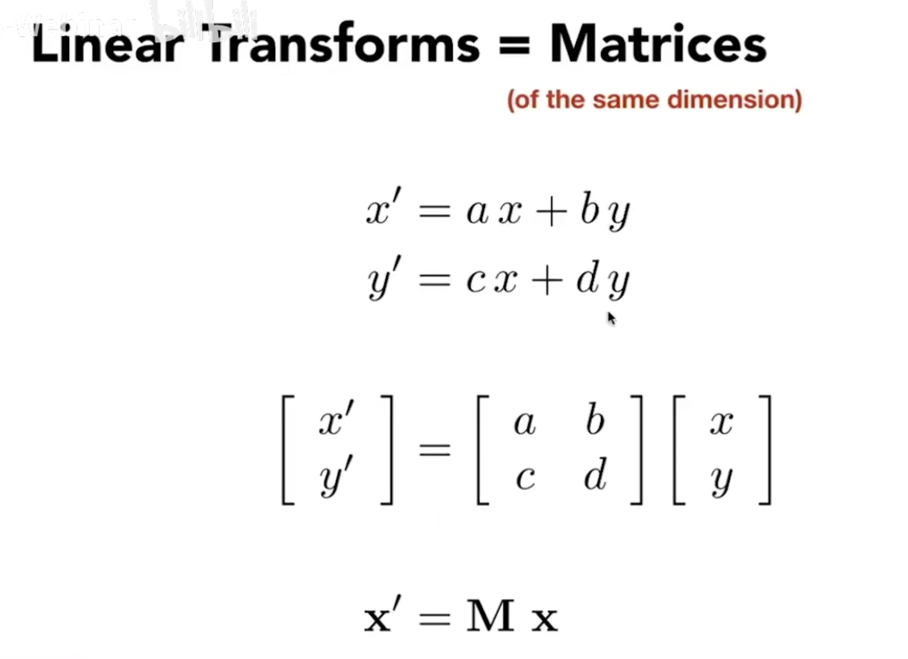
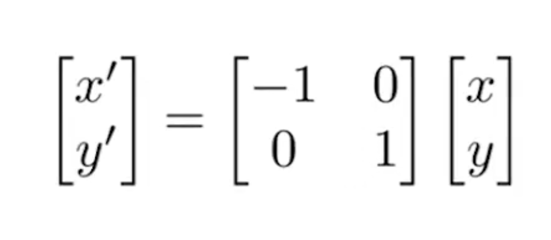
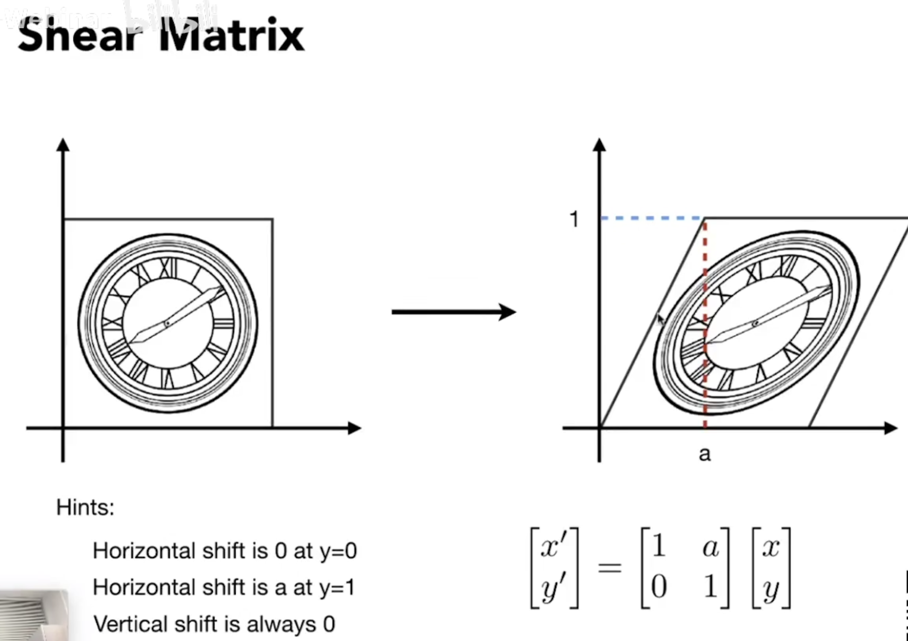
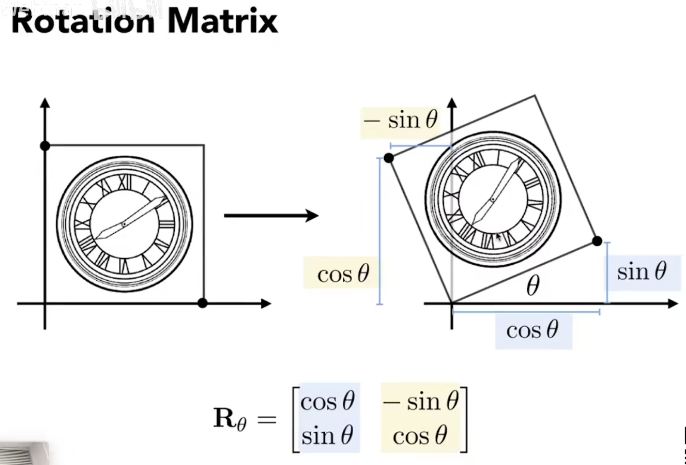
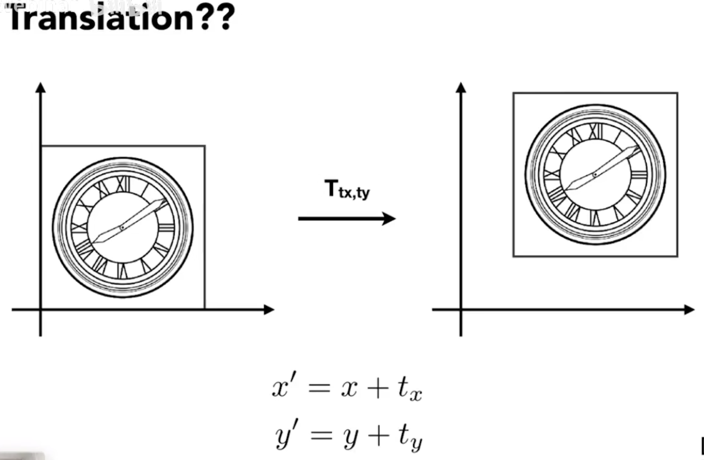
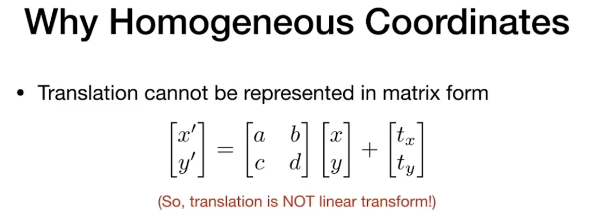
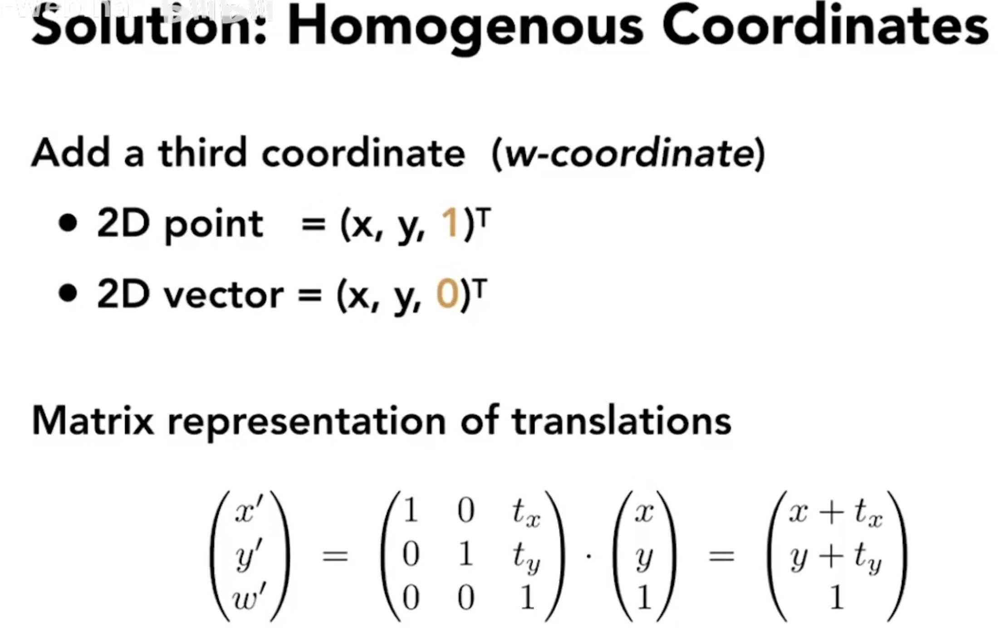
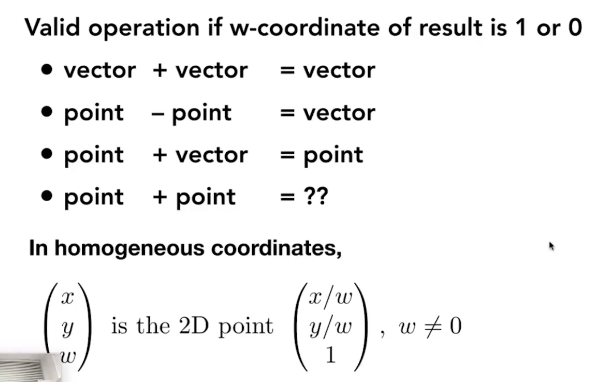
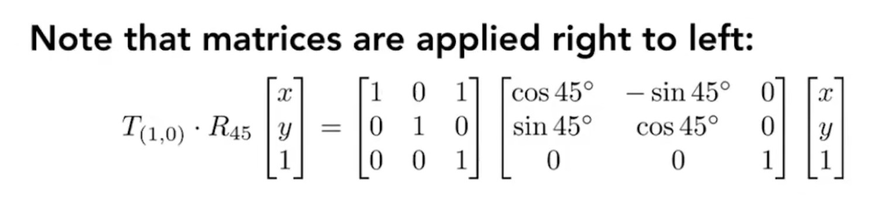
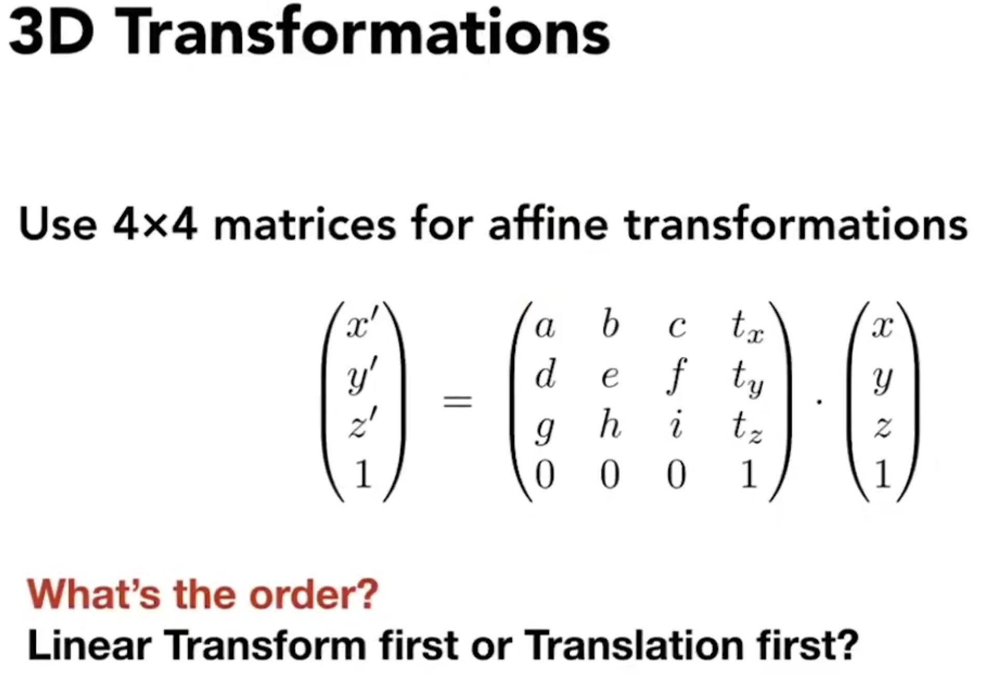

# 变换

## 线性变换

- 用一个矩阵去乘以输入的坐标，得到一个输出的坐标，我们把这种变化称为线性变换。
	

- 缩放(Scale Transform)
  - 可以是均匀缩放
  - 也可以是不均匀的缩放

	

  > $\begin{bmatrix} x' \\ y' \\ z' \end{bmatrix} = \begin{bmatrix} s & 0 & 0 \\ 0 & s & 0 \\ 0 & 0 & s \end{bmatrix}*\begin{bmatrix} x \\ y \\ z \end{bmatrix}$

- 反射（对称）(reflection)
	

	> $\begin{bmatrix} x' \\ y' \\ z' \end{bmatrix} = \begin{bmatrix} -1 & 0 & 0 \\ 0 & 1 & 0 \\ 0 & 0 & 1 \end{bmatrix}*\begin{bmatrix} x \\ y \\ z \end{bmatrix}$

- 切变(shear matrix)
	

	> $\begin{bmatrix} x' \\ y' \\ z' \end{bmatrix} = \begin{bmatrix} 1 & a & 0 \\ 0 & 1 & 0 \\ 0 & 0 & 1 \end{bmatrix}*\begin{bmatrix} x \\ y \\ z \end{bmatrix}$

- 旋转（Rotate）
	
	

	已知右下角点位A(1,0,0),旋转角度为$\theta$。我们根据三角函数求得旋转后的点位A'(cos$\theta$,sin$\theta$,0)。
	已知左上角角点位A(0,1,0),旋转角度为$\theta$。我们根据三角函数求得旋转后的点位A'(-sin$\theta$,cos$\theta$,0)。
	我们根据旋转前的点位和旋转后的点位进行推导：
	> $\begin{bmatrix} x' \\ y' \\ z'\end{bmatrix} = \begin{bmatrix} ? & ? & 0 \\ ? & ? & 0 \\ 0 & 0 & 1 \end{bmatrix}*\begin{bmatrix} x \\ y \\ z \end{bmatrix}$

	> $\begin{bmatrix} cos\theta \\ sin\theta \\ 0 \end{bmatrix} = \begin{bmatrix} A & B & 0 \\ C & D & 0 \\ 0 & 0 & 1 \end{bmatrix}*\begin{bmatrix} 1 \\ 0 \\ 0 \end{bmatrix}$

	> $cos\theta = A*1 + B*0 + 0*z\\ =A$

	> $sin\theta = C*1 + D*0 + 0*z\\ =C$

	> $\begin{bmatrix} -sin\theta \\ cos\theta \\ 0 \end{bmatrix} = \begin{bmatrix} A & B & 0 \\ C & D & 0 \\ 0 & 0 & 1 \end{bmatrix}*\begin{bmatrix} 0 \\ 1 \\ 0 \end{bmatrix}$

	> $-sin\theta = A*0 + B*1 + 0*z\\ =B$

	> $cos\theta = C*0 + D*1 + 0*z\\ =D$

	由此，我们可以得到完整的旋转矩阵 
	$\begin{bmatrix}
	cos\theta&-sin\theta&0 \\
	sin\theta&cos\theta&0 \\
	0&0&1
	\end{bmatrix}$

## 非线性变换

- 平移
	

	平移公式
	> $
		x' = x + tx \\
		y' = y + ty \\
		z' = z + tz $

	写成矩阵形式
	$\begin{bmatrix}
		x' \\
		y' \\
		z'
		\end{bmatrix} = \begin{bmatrix}
		x \\
		y \\
		z
		\end{bmatrix}
		+
		\begin{bmatrix}
		tx \\
		ty \\
		tz
		\end{bmatrix}$

	

	由此可见，平移不是线性变换。
	但是我们不希望把平移变换当作一个特殊的变换来处理，我们希望能有一个统一的方法来表示各种不同的变化。因此我们引入了齐次坐标。

- 齐次坐标
	

	- 引入齐次坐标的目的就是为了把所有的变换写成一个矩阵 * 一个向量这样的形式
	>对于任何一个点位，我们把它写成(x,y,z,1)
	对于任何一个向量，我们把它写成(x,y,z,0)
	这个取决于你的目的是想把(x,y,z)表示成一个点位还是一个向量
	引入了齐次坐标后的矩阵：
	$\begin{bmatrix}
	x' \\
	y' \\
	z' \\
	w'
	\end{bmatrix} = \begin{bmatrix}
	1&0&0&tx \\
	0&1&0&ty \\
	0&0&1&tz\\
	0&0&0&1
	\end{bmatrix} * 
	\begin{bmatrix}
	x \\
	y \\
	z\\
	1
	\end{bmatrix}
	=
	\begin{bmatrix}
	x+tx \\
	y+ty \\
	z+tz\\
	1
	\end{bmatrix}$
	为什么我们把向量和点位区分开呢？因为向量具有平移不变性，不论我们怎么平移向量，他的大小和方向都不会改变，如果有一个向量(x,y,z),我们经过平移变换后，希望它还是(x,y,z)而不是(x+tx,y+ty,z+tz),所以向量是(x,y,z,0)。

	

	一个点和一个点相加 得到的是这两个的中点
	因为两个点相加之后，最后一位是2，需要把这个值变成1，所以需要除2得到的就是中点
	> 向量(1,2,0,0) + 向量(4,5,0,0) = 向量(5,7,0,0)
	> 点位(4,5,0,1) - 点位(1,2,0,1) = 向量(3,3,0,0)
	> 点位(1,2,0,1) + 向量(4,5,0,0) = 点位(5,7,0,1)
	> 点位(1,2,0,1) + 点位(4,5,0,1) = 点位(5,7,0,2) = (5/2,7/2,0,2/2) = 中点(2.5,3.5,0,1)
	因此后面是0还是1是有意义的。
  
- 仿射变换
	仿射变换 = 线性变换 + 平移
	
	齐次坐标的表示形式：
	

- 左乘
	就旋转而言，默认都是以原点为旋转中心
	
	所以我们都是先旋转，再平移。
	写成矩阵的形式的时候，就是从右向左计算，也就是左乘
	

- 变换的顺序
	无论是2D还是3D都是先线性变换再平移
	
