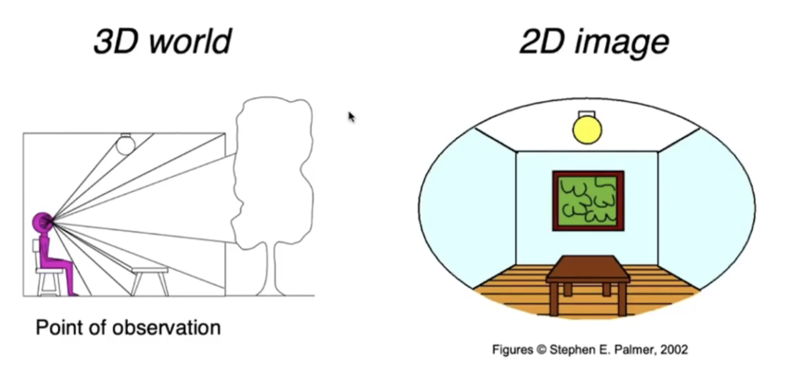
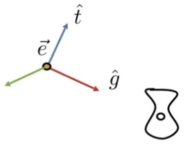
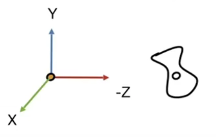
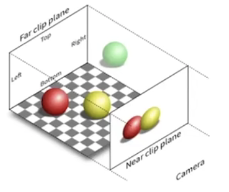
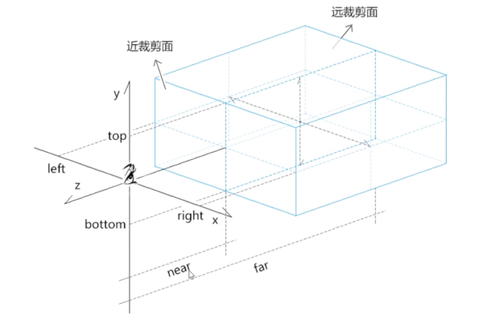
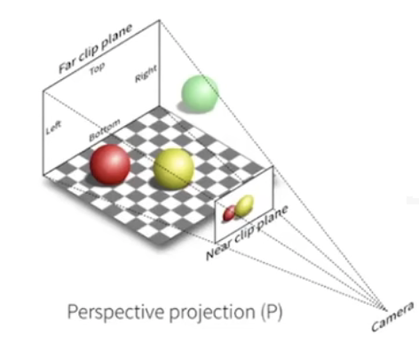
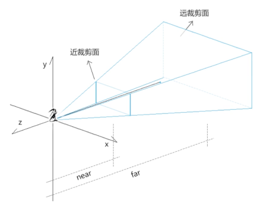

# 投影

我们使用相机去拍摄世界，世界是三维的，照片是二维的。从三维到二维，我们称之为投影。如图：

想象一下我们使用相机去拍摄世界，首先，我们需要一个满意的场景(模型)，其次我们需要找到一个满意的拍摄角度(视图)。最后我们按下快门(投影)，把三维世界投影到二维照片上。
## 视图变换
> 视图变换指的是对相机的摆放。需要根据相机的位置，相机看向的方向，相机向上方向(相机倾斜/向下/向上拍摄出来的照片效果不一样)。

假设我们在摄影棚中进行拍摄，如果相机和模型的相对位置固定不变，那么我们不论在哪个摄影棚中去进行拍摄，得到的照片结果都不会发生改变，而在图形学中，有一个约定俗成的事，即把相机放在一个标准位置(原点)上，往-z轴方向看，相机的上方向是y轴。
如图：
 

我们需要把左图的相机移动到右图的位置，为了保证拍摄的结果不发生改变，我们需要把模型移动同样的位置，保持相机和模型之间的相对位置没有变化。这一系列的变换就是**视图变换**。
接下来，我们来推导下这个视图变换矩阵。
首先我们把相机位置移到原点，即把e点平移到原点，需要一个平移矩阵(需要先平移在旋转，如果使用其次坐标的话，会先进行线性变换再平移，所以我们需要两个矩阵)。

> 平移矩阵  $\begin{bmatrix} 1 & 0 & 0 & -ex \\ 0 & 1 & 0 & -ey \\ 0 & 0 & 1 & -ez \\ 0 & 0 & 0 & 1 \end{bmatrix}$

平移矩阵比较简单，很容易就推导出来了，旋转矩阵比较麻烦，我们先确定两点：把相机看向的方向g旋转到-z轴，把相机的上方向t旋转到y轴。这时我们还缺少另一个轴的向量，可以根据得到另一个向量(右手法则)并把它旋转到x轴。
如果想把一个相机看向的方向g旋转到-z轴上，这个矩阵其实不怎么好确定，但是我们把-z轴旋转到g方向其实比较容易，因为-z是一个已经确定的的单位向量(0,0,-1)。

> 旋转矩阵 -z->g  $\begin{bmatrix} g.x \\ g.y \\ -g.z \\ 0 \end{bmatrix} = \begin{bmatrix} 1 & 0 & g.x & 0 \\ 0 & 1 & g.y & 0 \\ 0 & 0 & g.z & 0 \\ 0 & 0 & 0 & 1 \end{bmatrix}*\begin{bmatrix} 0 \\ 0 \\ -1 \\ 0 \end{bmatrix}$

> 旋转矩阵   y->t  $\begin{bmatrix} t.x \\ t.y \\ t.z \\ 0 \end{bmatrix} = \begin{bmatrix} 1 & t.x & 0 & 0 \\ 0 & t.y & 0 & 0 \\ 0 & t.z & 0 & 0 \\ 0 & 0 & 0 & 1 \end{bmatrix}*\begin{bmatrix} 0 \\ 1 \\ 0 \\ 0 \end{bmatrix}$    

> 旋转矩阵   x-> $\vec{g}\cdot\vec{t}$   $\begin{bmatrix}  (\vec{g}\cdot\vec{t}).x  \\  (\vec{g}\cdot\vec{t}).y \\  (\vec{g}\cdot\vec{t}).z \\ 0 \end{bmatrix} = \begin{bmatrix} (\vec{g}\cdot\vec{t}).x & 0 & 0 & 0 \\ (\vec{g}\cdot\vec{t}).y & 1 & 0 & 0 \\ (\vec{g}\cdot\vec{t}).z & 0 & 1 & 0 \\ 0 & 0 & 0 & 1 \end{bmatrix}*\begin{bmatrix} 1 \\ 0 \\ 0 \\ 0 \end{bmatrix}$

最后把这三个矩阵合并为一个矩阵:

> $\begin{bmatrix} (\vec{g}\cdot\vec{t}).x & t.x & g.x & 0 \\ (\vec{g}\cdot\vec{t}).y & t.y & g.y & 0 \\ (\vec{g}\cdot\vec{t}).z & t.z & g.z & 0 \\ 0 & 0 & 0 & 1 \end{bmatrix}$

并且计算它的逆矩阵,旋转矩阵是正交矩阵，它的逆矩阵就是它的转置矩阵。因此，我们得到最终的矩阵：
> $\begin{bmatrix} (\vec{g}\cdot\vec{t}).x & (\vec{g}\cdot\vec{t}).y  &  (\vec{g}\cdot\vec{t}).yz & 0 \\ t.x & t.y & t.z & 0 \\ g.x & g.y & g.z & 0 \\ 0 & 0 & 0 & 1 \end{bmatrix}$

视图变换操作的是相机，其他模型需要跟着变换保证相对位置不变。因此相机应用了该变换矩阵后后，模型也同样需要应用同样的变换矩阵。

## 正交投影
正交投影是具有矩形观察体的投影方式，它不会根据物体离视点的远近缩放物体。

 

正交投影是相对简单的一种投影，坐标的相对位置都不会改变，所有光线都是平行传播，我们只需将物体（可视部分，即上边左图的那个长方体）全部缩放到一个 $$[-1, 1]^3$$ 的空间之中即可（其中x，y坐标便是投影结果，保留z是为了之后的遮挡检测）。

> 正交投影更多用来做工程制图。

我们在x轴上定义矩形的左右距离(left,right)，在y轴上定义矩形的上下距离(top,bottom)，在z轴上定义矩形的前后距离(near,far)，这样一个矩形空间就出来了。我们把矩形空间的中心平移到坐标原点。这时咋们在做一个操作，不管之前定义的矩形空间有多大，都把它缩放成-1到1的一个大小空间中。

> 转换到-1到1的空间中是为了后续的计算方便，在转换到屏幕坐标的时候就会重新拉伸回来。

我们先推导平移矩阵：

>  $\begin{bmatrix} 0 \\ 0 \\ 0 \\ 0 \end{bmatrix} = \begin{bmatrix} 1 & 0 & 0 & -(left + right) / 2 \\ 0 & 1 & 0 &  -(top + bottom) / 2 \\ 0 & 0 & 1 & -(near + far) / 2 \\ 0 & 0 & 0 & 1 \end{bmatrix} * \begin{bmatrix} (left + right) / 2 \\ (top + bottom) / 2 \\ (near + far) / 2 \\ 1 \end{bmatrix}$

我们先算出矩形空间的中心点((right+left)/2,(top+bottom)/2,(near+far)/2)，在乘以一个平移矩阵得到原点(0,0,0)，因此这个平移矩阵是：
>  $\begin{bmatrix} 1 & 0 & 0 & -(left + right) / 2 \\ 0 & 1 & 0 &  -(top + bottom) / 2 \\ 0 & 0 & 1 & -(near + far) / 2 \\ 0 & 0 & 0 & 1 \end{bmatrix}$

接着我们开始推导缩放矩阵：
$\begin{bmatrix} 2 \\ 2 \\ 2 \\ 0 \end{bmatrix} = \begin{bmatrix} 2 /(right - left) & 0 & 0 & 0 \\ 0 & 2 / (top - bottom) & 0 & 0 \\ 0 & 0 & 2 / (near - far) & 0 \\ 0 & 0 & 0 & 1 \end{bmatrix} * \begin{bmatrix} (right - left)  \\ (top - bottom) \\ (near - far) \\ 1 \end{bmatrix}$

我们先算出矩形空间的一个点，就以最大点为例，原矩形空间的最大点是(right-left,top-bottom,near-far)。缩放为-1到1的矩形空间大小，该矩形空间最大点是(2,2,2)。因此推导出的缩放矩阵是：

> $\begin{bmatrix} 2 /(right - left) & 0 & 0 & 0 \\ 0 & 2 / (top - bottom) & 0 & 0 \\ 0 & 0 & 2 / (near - far) & 0 \\ 0 & 0 & 0 & 1 \end{bmatrix}$

最终得到的正交投影矩阵：
两个矩阵相乘，第一个矩阵的第一行乘以第二个矩阵的第一列得到的是新矩阵的第一行第一列。

> $\begin{bmatrix} 2 /(right - left) & 0 & 0 &  -(right + left)/(right - left)
 \\ 0 & 2 / (top - bottom) & 0 & -(top + bottom)/(top - bottom) 
 \\ 0 & 0 & 2 / (near - far) & -(near + far)/(near - far)
 \\ 0 & 0 & 0 & 1 \end{bmatrix}$ = 
$\begin{bmatrix} 2 /(right - left) & 0 & 0 & 0 \\ 0 & 2 / (top - bottom) & 0 & 0 \\ 0 & 0 & 2 / (near - far) & 0 \\ 0 & 0 & 0 & 1 \end{bmatrix}$ * $\begin{bmatrix} 1 & 0 & 0 & -(left + right) / 2 \\ 0 & 1 & 0 &  -(top + bottom) / 2 \\ 0 & 0 & 1 & -(near + far) / 2 \\ 0 & 0 & 0 & 1 \end{bmatrix}$

我们以新矩阵的第一行举个例吧(为了方便观看，我把第一行以列的形式格式化下)：
$\begin{bmatrix} 2 / (right - left) \\ 0 \\ 0 \\ -  (right + left)/(right - left)  \end{bmatrix}$ = $\begin{bmatrix} 2 / (right - left) * 1 + 0 * 0 + 0 * 0 + 0 * -(right + left) / 2 \\ 2 / (right - left) * 0 + 0 * 1 + 0 * 0 + 0 * -(right + left) / 2 \\ 2 / (right - left) * 0 + 0 * 0 + 0 * 1 + 0 * -(right + left) / 2 \\ 2/(right - left) * -(right + left) / 2 + 0 * 0 + 0 * 1 + 0 * 0 \end{bmatrix}$

## 透视投影
透视投影是具有视锥观察体的投影方式，它会根据物体离视点的远近缩放物体(近大远小)。

透视投影就是最类似人眼所看东西的方式，遵循近大远小，如果说正交投影都是水平光线，那么透视投影则显然不是了。

 